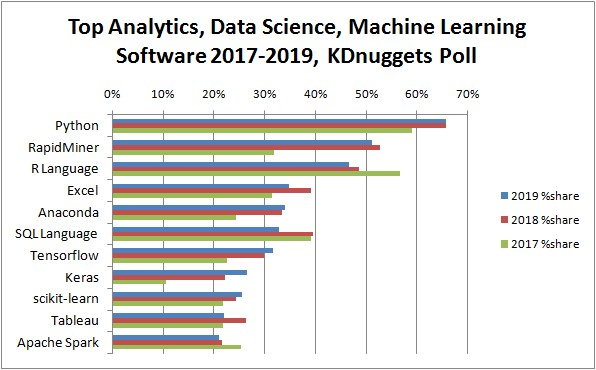

```{r setup, include=FALSE}
# clean up the environment
rm(list = ls())
# setup chunk options
knitr::opts_chunk$set(
  message = FALSE,
  warning = FALSE,
  fig.align = "center",
  comment = "#>"
)
options(scipen = 9999)

```

The following coursebook is the main part for _Online Data Science Series: Deep Learning for Sentiment Analysis_ workshop produced by the team at [**Algoritma**](http://algorit.ma/) . [**Algoritma**](http://algorit.ma/) is a data science education center based in Jakarta. We organize workshops and training programs to help working professionals and students gain mastery in various data science sub-fields: data visualization, machine learning, data modeling, statistical inference, etc.

Before you go ahead and run the codes in this coursebook, it’s often a good idea to go through some initial setup. Under the **Training Objectives** section we’ll outline the syllabus, identify the key objectives and set up expectations for each module. Under the **Libraries and Setup** section you’ll see some code to initialize our workspace and the libraries we’ll be using for the projects. You may want to make sure that the libraries are installed beforehand by referring back to the packages listed here. 

# Preface {.tabset}

## Introduction

**Text mining**, also referred to as text data mining, similar to text analytics, is the process of deriving high-quality information from text. There are many application of text mining, such as:

- Text Classification
- Text Summarization
- Text Generation
- Topic Modeling
- Named Entity Recognition

Text classification has broad applications such as *topic labeling*, *spam detection*, and **_sentiment analysis_**. Take a look at a text example below:

> *"Have bought items multiple times and very happy with services. Communications are exceptional."*

In a grand sense, we are interested in the emotional content of some text, e.g. posts on Facebook, tweets, or movie reviews. Most of the time, this is obvious when one reads it, but if you have hundreds of thousands or millions of strings to analyze, you’d like to be able to do so efficiently. Sentiment Analysis is one of a common tool to help companies, analysts and researchers to learn public opinions towards certain topics. It works by extracting positive and negative sentiments from each word of a text document. 

We will later discuss more on various sentiment analysis techniques and its machine learning approach. But before that, in this very first part of this workshop, I want you to familiarize yourself with the tool that we're going to use for the next 4 days; R.

## Training Objectives

The primary objective of this course is to provide a participant a comprehensive introduction about tools for building sentiment analysis model using one of the most popular open-source tools; R. The material will covers:

**Introductory Module: Text Mining in R**

* **Tools Introduction**  
  + R and R Studio  
  + Open source packages  
  + Using R Markdown  
  + R Programming Basics  
* **Text mining in R**  
  + Preparing your text data: data cleansing and manipulation
  + Word-tokenizing to identify word’s meaning
  + Using visualization to analyze text data
  
***
**Main Module: Deep Learning for Sentiment Analysis**

* **Introduction to Neural Network and Deep Learning**  
  - Neural Network: What is it and how does it work? 
  - The exploding and vanishing gradient problem
  - Recurrent Neural Network (RNN) and the evolving LSTM

* **Sentiment Analysis with LSTM**
  - Building a neural network with LSTM using Keras
  - Model evaluation and tuning

## Library and Setup

In this **Library and Setup** section you’ll see some code to initialize our workspace, and the packages we’ll be using for this introductory session of this workshop. 

_Packages_ are collections of R functions, data, and compiled code in a well-defined format. The directory where packages are stored is called the _library_. R comes with a standard set of packages. Others are available for download and installation. Once installed, they have to be loaded into the session to be used. 

You will need to use `install.packages()` to install any packages that are not yet downloaded onto your machine. To install packages, type the command below on your console then press ENTER. 

```{r eval=FALSE}
## DO NOT RUN CHUNK
# packages <- c("tidyverse", "scales")
# 
# install.packages(packages)
```

Then you need to load the package into your workspace using the `library()` function. Special for this course, the _rmarkdown_ packages do not need to be called using `library()`.

```{r}
# # Data Wrangling
library(tidyverse) 
library(lubridate)

# Text analysis
library(textclean)
library(tidytext)
```


# Introduction to R

## Why learn R?

One of the amusing topics that you might find online is people discussing about which programming language to learn for if you’re about to dive deeper into data science world. The following poll shows the popular data science and machine learning tools:

```{r echo=FALSE, out.width="600px"}

```

The data seen on the statistics above is collected through KDnugget pools where people vote which data analysis tools they are using inclusively. On average, people are selecting up to 7 tools. We see, indeed there a lot if tools to use when we’re talking about data analysis. R, is one of the tools that has very high share, along with Python and Rapidminer. It is indeed one of the most popular tools in working with data. So why R?

* **Built by Statistician**

One of the special thing about R is, it is programming language that is developed around statistician. It is built from the needs and perspective of a statistician. R is created for the purpose of data analysis and as such, is different in nature from traditional programming languages.

* **Libraries**

R libraries extend R graphical abilities, and adds out-of-the-box functionalities for linear and non-linear modeling, statistical tests (confidence tests, P-value, t-test etc), time-series analysis, and various machine learning tasks such as regression algorithms, classification algorithms, and clustering algorithms.

* **Open Source**

The R community is noted for its active contributions in terms of packages and part of the reason for its active and rapidly growing community is the open-source nature of R. Users can contribute packages, many of which packaged some of the most advanced statistical tools. Even big companies like Google, Twitter, and Facebook has contribute their data analysis libraries to be accessible in R.

* **Ready for Big Data**

RHadoop, ParallelR, Revolution R Enterprise and a handful of other toolkits adds powerful big data support, allowing data engineers to create custom parallel and distributed algorithms to handle parallel / map-reduce programming in R. This makes R a popular choice for big data analytics and high performance, enterprise-level analytics platform.

## Navigating R Studio

Before we venture further into our data, we’ll take one step back to familiarize ourselves with the tools we will use. By now, you should be able to install **R** and **R Studio** in your machine. But what is the difference between the two? R and R Studio is a different application, and each has its role.

Not to be confused with R language, R Studio, is a supplementary application *made for streamlining the workflow of working with R*, this type of application is commonly known as _Integrated Development Environment_ (IDE) (See Fig. \@ref(fig:r-rstudio)). The application you are opening right now is called R Studio and under the hood, R Studio is communicating with an R session by sending the command on the chunk above through the *console* Window on the bottom of the application. If you strip down R Studio to its very core, really the R console on the bottom is the same one as R console when you open the original R application on your machine.

```{r r-rstudio, echo = FALSE, fig.align = "center",fig.width=5,fig.height=4, fig.cap="Relationship between R and RStudio"}
knitr::include_graphics("img/rrstudio.PNG")
```

In the beginning of this chapter, we have discussed the main difference between R and R Studio. In R Studio, you might notice a few windows, if you’re reading this on R Markdown file, you’ll be looking at the *Source Pane* in R Studio. Now let’s take alook at the default layout of R Studio:

```{r rstudio, echo = FALSE, fig.align = "center", fig.cap="R Studio Panes"}

```

In Figure \@ref(fig:rstudio), you can find that there are 4 main panes for you to familiarize yourself with:    

1. **Source Pane**: This pane displays the original file opened using R Studio. This is the main feature of R Studio, since it is essentiallya file editor application equipped with a s of features that support your works.    

2. **Console Pane**: This pane displays the _original R console_ used to communicate with R session. There are also tabs such as _Terminal_ used for accessing your machine command-line interface.    

3. **Environment / History Pane**: This pane display all created R variables in the session. There are also tabs such as History if you need to trace back your previous ran codes.    

4. **Fourth Pane** consist of multiple tabs:   
    - **Files Pane**: List the files in your working directory    
    - **Plots Pane**: Display visualization output    
    - **Packages Pane**: List all installed and loaded packages    
    - **Help Pane**: Display the official documentation for functions   

The mainfocus in using R Studio should be on the source pane where you can edit your files. 

## Reporting with Rmarkdown

In this course, we will be using an _R Markdown_ file. It is one of the tools that has a deep integration with R Studio and its functionalityis developed within `rmarkdown` package. The package is made for easy development of dynamic document tool for R. R Markdown turn our analysis into high-quality reports. 

If you take alook at the original project directory, you should see there are sever files with under `.Rmd` extension and `HTML` file. The HTML was generated using R Markdown functionality: **knit**.

For example, in this R-markdown it consists of 2 things: R chunk and Narration. If you see something with the following shade in R markdown file:

{ width=200% }

You are looking at an **R chunk** where you can put your codes and interact with R, and even getting the result right on the file itself. You can add your own R chunk with two options:  

a. Use a shortcut of `Ctrl`+`Alt`+`I`  
b. Use the Insert button on the top right of your source pane and choose R

----

> **Dive Deeper 1**:  

1. Insert a new chunk below (you can choose whatever is convenient for you; whether by using a shortcut or the insert button)!  
2. In the chunk you just created, try to type `1+100`. Run the chunk and see what happen!
3. Add `#` symbol in the beginning of `1+100`. Run the chunk again and see what happen!

```{r}
1+100
```


__*Notes: Running the code chunk*__  
RStudio offers you great flexibility in running code from within the editor window. There are buttons, menu choices, and keyboard shortcuts. To run the current line, you can:

  a. click on the Run button above the editor panel, or<br>
  b. select “Run Lines” from the “Code” menu, or<br>
  c. hit `Ctrl`+`Enter` in Windows, `Ctrl`+`Return` in Linux, or `⌘`+`Return` on OS X.
  d. To run a block of code, select it and then `Run`.
  
----

# R Programming Basics

As we have mentioned in the earlier section, R is one of the most popular tools in working with data. In R, you will store a data in an R object. The object is stored in a memory for each R session and is stored under an assigned name. This is an example of creating an R object:  

```{r}
address <- "Algoritma Data Science School, Jl. Prof. DR. Satrio No.164, RT.4/RW.4"
```

If you run the chunk above, you should see a newly created variable in the environment pane called `address`. This way, we could easily call every object we have created using the variable name:

```{r}
address
```

To store multiple values in a variable, you can use `c()` function. For example:

```{r}
# an example of storing multiple values into a variable:
price <- c(15000,10000, 7000)
price
```

----

> **Dive Deeper 2**:  

1. Insert a new chunk below (again, you can choose whatever is convenient for you; whether by using a shortcut or the insert button)!  
2. Create a new variable, name it `participants`, pick at least 3 random names from the participants in this Zoom meeting (you may also use your friends' name if you are not joining the Zoom session)! 
3. Try to call again the values you just stored in `participants`, but change the text to uppercase (`PARTICIPANTS`) and see what happen!

```{r}
participants <- c("Enlik","Farhan","Mika")
participants
```

```{r}
toupper(participants)
```

----

_**Notes: Creating a Variable**_:  

1. You need to name an object and use the `<-` to assign a value 
2. An object name needs to start with an alphabet, can contain alphanumerics, dots (`.`), and underscores (`_`)  
3. R is case-sensitive so `participants` and `PARTICIPANTS` are different symbols and will point to different variables.

`address`, `price` and `participants` are example of R's vector data. A vector is the most common and basic data structure in R and is pretty much the workhorse of R. It is a collection of elements that are most commonly of mode `character`, `logical`, `integer` or `numeric`.

```{r}
class(address)
class(price)
```

## Data Structures and Classes

Consider this case:
  
*You are working in an company and is given an excel file consisting the employees data from 2019. Can you imagine how will the data look like? How would you store the data in R?*

In R, a tabular data format will be stored as a `data.frame`. Let's first take a look an example of a dataframe below:
 
```{r}
employees <- data.frame(
 name = c("Shello", "Ardhito", "Arlene", "Bagas", "Cipto"),
 age = c(25L, 30L, 28L, 44L, 29L),
 join.date = as.Date(c("2019-01-02","2020-11-23","2017-04-02","2010-02-03","2019-02-03")),
 monthly.rate = c(11, 12.5, 11, 35.5, 15),
 division = factor(c("Marketing", "HR", "Marketing", "Sales", "HR")),
 active = c(TRUE, FALSE, FALSE, TRUE, TRUE)
)

employees
```
 
`**data.frame**` is the most common way of storing data in R, and if used systematically makes data analysis easier. Under the hood, a data frame is a *list* of equal-length `**vectors**`. To access the column (`vector`) of a data frame, we can use the syntax of `data$column`

```{r}
class(employees$age)
```

We can use `str()` to easily observe a dataframe structures:

```{r}
str(employees)
```

R has several types of vectors including:

- Character
- Numeric
- Integer
- Logical
- Factors
- Dates

When dealing with text, objects of class `character` are what we'd typically be dealing with. For more complete explanation and deeper understanding of R programming you can learn from the book written by Hadley Wickham; [R for Data Science](https://r4ds.had.co.nz/). 


## Exploratory Data with `tidyverse`

### Data Wrangling with `dplyr`

Data wrangling is one of the crucial part in preparing any analytics task. The transformation may refer to the process of cleaning, selecting certain observations (rows) or variables (columns), performing aggregation and calculate summary statistics to restructure the data into a more insightful format. 

R is provided with vast built-in tools which can help us perform all those operations, but in this section, we will use the functions provided by `dplyr` from the `tidyverse` package instead, considering how the grammar offered by `dplyr` has always been more intuitive and the easiest to read. 

Let's start by reading our data. The data we'll be using for this workshop is a dataset from [Kaggle](https://www.kaggle.com/crowdflower/twitter-airline-sentiment/home), a text data consists of 14.64 tweets about airlines companies in US:

```{r}
tweets <- read_csv("data/airlines.csv",)
glimpse(tweets) # equivalent with `str()`
```

In this introductory session, we’re going to cover some of the most commonly used  `dplyr` functions as well as using pipes (`%>%`) to combine them. Say, we want to observe the daily sentiments towards "American Airlines".

Let's start with `select()`. You can use `select()` to select the only columns you need. For example, to select relevant columns for our analysis:

```{r, eval=FALSE}
select(.data = tweets, tweet_created, text, label)
```

The strengths of dplyr lie in combining several functions using pipes (`%>%`). Let’s repeat what we’ve done above using pipes:

```{r, eval=FALSE}
tweets %>% 
  select(tweet_created, text, label)
```

Say, we're only interested in opinions towards American Airlines. We can use `filter()` to filter rows based on conditions:

```{r, eval=FALSE}
tweets %>% 
  filter(airline == "American") %>%  
  select(tweet_created, text, label) 

```

If you want to manipulate columns, whether updating the value of existing column, or create new column, you can use `mutate()`. For example, in the chunk below, we use `mutate()` to adjust the class of `tweet_created`:

```{r, eval=FALSE}
# library(lubridate)

tweets %>% 
  filter(airline == "American") %>% 
  select(tweet_created, text, label) %>%  
  mutate(
    tweet_created = ymd_hms(tweet_created)
  )
```

You can also add new column from the same method. For example if we're interested in getting the date information:

```{r, eval=FALSE}
tweets %>% 
  filter(airline == "American") %>% 
  select(tweet_created, text, label) %>%  
  mutate(
    tweet_created = ymd_hms(tweet_created),
    tweet_created_date = date(tweet_created)
  ) 
```

To aggregate and count values, we can simply use `count()`:

```{r}
tweets_aa <- tweets %>% 
  filter(airline == "American") %>% 
  select(tweet_created, text, label) %>%  
  mutate(
    tweet_created = ymd_hms(tweet_created),
    tweet_created_date = date(tweet_created)
  ) %>% 
  count(tweet_created_date, label)

tweets_aa
```

----

> **Dive Deeper 3**:  

Try to copy down the code above to count the daily sentiments from "Virgin America" airline. Does it showing the same trend as "American Airlines"?

----

### Data Visualization with `ggplot2`

Often times in our analysis, we need visualization tools to help us uncover certain pattern from our data. `tidyverse` also equipped with a popular data visualization library; `ggplot2`. In this section, we'll cover the basic concept of `ggplot2` plotting system. 

Let's get back to our `tweets_aa` data. Say, we want to observe the daily trend of American Airline's negative sentiments:

```{r}
tweets_aa_neg <- tweets_aa %>% 
  filter(label == "negative")

tweets_aa_neg
```
We’ll begin to create a ggplot object by using `ggplot()`. Because of the range of the data values, this plot will use that and create a plot with these values on each scales (scales, by the way, can be thought of as just the two axis right now). Note that we’re just creating a blank plot with no geometry elements (lines, points, etc) on it yet:

```{r}
ggplot(tweets_aa_neg, aes(x = tweet_created_date, y = n))
```
Notice how ggplot() takes two arguments:

- The data
- The aes which allow us to specify our mapping of the x and y variables so they are used accordingly by ggplot

Once we created our ggplot object, we can now add a layer onto it using `geom_*`. `geom_*` is ggplot’s way of handling geometry, i.e. how the data are represented on the plot. To illustrate this idea, let’s add a `geom_line()` and see the resulting object:

```{r}
ggplot(tweets_aa_neg, aes(x = tweet_created_date, y = n))+
  geom_line()
```
A recap of what we’ve done so far:

- Creating our ggplot graphics object through `ggplot()`
- We specify 2 arguments in our call to ggplot; It’s helpful to note that any argument we pass into `ggplot()` will be used as global options for the plot, i.e. they apply to all layers we add onto that graphics object
- For the second argument we use the `aes()` function, allowing us to map variables from the negative tweets frequencies (`n`) to aesthetic properties of the plot (in our case we map them to the x and y axis)
- We tell ggplot how we want the graphic objects to be represented by adding (through the `+` operator) our geom layer. Since we added `geom_line()`, this is equivalent to adding a layer of a line chart to represent our x and y variables

To add more layers to our plot, we can simply use `+` and add whichever element we want to layer on our plot:

```{r}
ggplot(tweets_aa_neg, aes(x = tweet_created_date, y = n))+
  geom_line()+
  geom_point()+
  labs(
    title = "Number of Negative Sentiments toward American Airlines, 19-24 Feb 2015",
    subtitle = "The numbers were raised in 23 Feb due to an airline incident",
    x= "Date", y = "Tweet Counts"
  )
```

This workshop will only cover some basic usage of `ggplot2` for exploratory data visualization. If you're interested to explore more about `ggplot2` plotting system, you can read its documentation [here](https://ggplot2-book.org/)

# Text Mining Essentials

Whether to perform simple analysis, or build a machine learning model, the data we're working comes with structured format; that is, having rows and columns. However, text data came in unstructured format; i.e. in form of sentences, paragraphs, and words. 

Consequently, we would have to carry out a large amount of pre-processing on the raw text data, to transform it into a structure that is more appropriate. The idea is to transform our text data into a more "digestible form" so that our computer can understand its context better. To illustrate the importance of text pre-processing, Jiaohao Weng published an interesting article[^1] where he experimented with [Azure text analytics API](https://azure.microsoft.com/en-in/services/cognitive-services/text-analytics/).

He tried to feed the API with a simple review example:

```{r azure1, echo = FALSE, fig.align = "center", out.width="600px", fig.cap="Azure text analytics API results as of publication date (30 Aug 2019)"}

```

However, after he performed some text pre-processing with the sentence, the model gave better prediction by returning negative sentiment, which is more appropriate to the text data:

```{r azure2, echo = FALSE, fig.align = "center", out.width="600px", fig.cap="Azure text analytics API results as of publication date (30 Aug 2019)"}

```

In general, the text pre-processing includes:

- **Text cleaning & normalization**: to reduce "noise" from text data
- **Tokenization**: to break down a sentence into individual terms/"token".

## Text Cleansing

Text cleansing is the most important part of text mining where we will remove and transform the text inside the corpus. The general text cleansing process including:

- Remove mention name
- Remove certain characters
- Removing hashtag (#rstats)
- Removing mention (@algoritma)
- Removing URL
- Remove punctuations 
- Remove numbers
- Remove double space
- etc.

Our main package for cleansing the text is `stringr` and the `textclean` package. `textclean` is a very helpful package that simplify the cleansing process. For transforming text, you will stumble upon something called **Regular Expression (Regex)**.

We will illustrate the cleansing process step-by-step before using it into the actual data. For samples, we will create an example of a text. You can see that the text has several additional element such as mention (@AmericanAir), hashtag(#AmericanAirlines), and URL or link to a webpage.

```{r}
text_sample <- "@AmericanAir over the last year 50% of my flights have been delayed or Cancelled.\nI'm done with you #AmericanAirlines http://t.co/DNMsblzumr"
text_sample
```

### Replace Characters

Some part of our text data might need replacement process. For example to replace `i'm` with `i am`. We can use `str_replace_all()` to replace certain character:

```{r}
text_sample %>% 
  str_replace_all("I'm", "I am")
```

To make replacement easier, `textclean` built with various function for words replacement. For example to perform the same task (replacing contracted word), we can use `replace_contraction()` function:

```{r}
# library(textclean)

text_sample %>% 
  replace_contraction() # replace contraction
```

We can also use other functions from `textclean` for various cleaning tasks such as `replace_url()`, `replace_html()` and many more. You can see its full documentation [here](https://github.com/trinker/textclean).

```{r}
text_sample %>%  
  replace_contraction() %>% # replace contraction 
  replace_url() # replace url
```

### Remove Characters

In text data, there are certain characters that may appear, such as `\n` that signify a line break or enter a new line. You can use `str_remove_all()` to remove a certain character:

```{r}
text_sample %>%  
  replace_contraction() %>% 
  replace_url() %>% 
  str_remove_all(pattern = "\n") # remove \n (line break)
```

You can also combine `str_remove_all()` with **RegEx** pattern. For example, to remove mentions, hashtags, and numbers:

```{r}
text_sample %>% 
  replace_contraction() %>% 
  replace_url() %>% 
  str_remove_all(pattern = "\n") %>% 
  str_remove_all("@([0-9a-zA-Z_]+)") %>% # remove username
  str_remove_all("#([0-9a-zA-Z_]+)") %>%  # remove hashtag
  str_remove_all(pattern = "[[:digit:]]") # remove digits
```

----

> **Dive Deeper**

Create a new chunk below, copy down the code above and try to remove `%` symbol from the tweet as well!

----

### Convert to Lower Text and Remove Whitespace

Since R and many programming languages are case sensitive, The word “People” and “people” can be recognized as a different word. Therefore, all text must be converted into a lowercase (no capital). Then, since we perform a lot of replacements, each word replacement may left extra whitespaces in our text. We can handle this by using `str_squish()`

```{r}
text_sample_clean <- text_sample %>% 
  replace_contraction() %>% 
  replace_url() %>% 
  str_remove_all(pattern = "\n") %>% 
  str_remove_all("@([0-9a-zA-Z_]+)") %>% # remove username
  str_remove_all("#([0-9a-zA-Z_]+)") %>%  # remove hashtag
  str_remove_all(pattern = "[[:digit:]]") %>% 
  str_remove_all("%") %>% 
  str_to_lower() %>% # lower characters
  str_squish() # remove extra whitespaces

text_sample_clean
```


Let's apply the techniques that we covered in our `airlines.csv` data:

```{r,warning=FALSE, message=FALSE}
tweets_aa <- tweets %>%
  mutate(
    text_clean = text %>%
      replace_url()  %>% 
      replace_html() %>% 
      str_remove_all("@([0-9a-zA-Z_]+)") %>% # remove username
      str_remove_all("#([0-9a-zA-Z_]+)") %>% # remove hashtag
      replace_contraction() %>%
      replace_word_elongation() %>% 
      replace_internet_slang() %>% 
      str_remove_all(pattern = "[[:digit:]]") %>% # remove number
      str_remove_all(pattern = "%") %>% 
      str_remove_all(pattern = "\\$") %>% # remove dollar sign
      str_to_lower() %>% # transform menjadi huruf kecil
      str_squish()  # remove extra whitespace
  ) %>% 
  filter(airline == "American") %>% 
  select(text, text_clean, label)

head(tweets_aa)
```

## Tokenize and Remove Stopwords

Tokenization is a process where we will break down a sentence into individual terms/token. This process is done for preparing subsequent analysis, such as counting the most frequent word and remove stopwords.

```{r tokenize, echo = FALSE, fig.align = "center", out.width="600px", fig.cap="Azure text analytics API results as of publication date (30 Aug 2019)"}
knitr::include_graphics("img/tokenize.png")
```

The `tidytext` package provide a good function to help us do tokenization by using `unnest_tokens()`. The input or text must be in a data frame, so first we create a data frame with the text stored inside the text column.

```{r}
tweets_aa <- tweets_aa %>% 
  select(-text) %>% 
  unnest_tokens(word, text_clean) 

head(tweets_aa)
```

### Remove Stopwords

Stop words are words that are not useful for an analysis, typically extremely common words such as “the”, “of”, “to”, and so forth in English. These words are appear in most of the documents and give no additional meaning for us (except for some cases). Sometimes we also need to create our own stop words, such as to remove certain words such as name of people, name of place, etc.

`tidytext` package provide us with the general English stop words on `stop_words` dataset.

```{r}
tweets_aa <- tweets_aa %>% 
  anti_join(stop_words)
```

## Text Visualization

Lastly, before we're moving to the next analysis, we can visualize our text data to gain more insights about our textual data. Here, I'm using `geom_text_wordcloud()` from `ggwordcloud` to show the 20 most frequent word from each negative, positive and neutral sentiments:

```{r}
tweets_aa %>% 
  count(word, label, sort = T) %>% 

  group_by(label) %>%
  top_n(20) %>%
  
  ggplot(aes(label = word, size = n, color = n)) +
  ggwordcloud::geom_text_wordcloud() +
  facet_wrap(~label) +
  scale_size_area(max_size = 15) 
```


----
*End of Part 1*