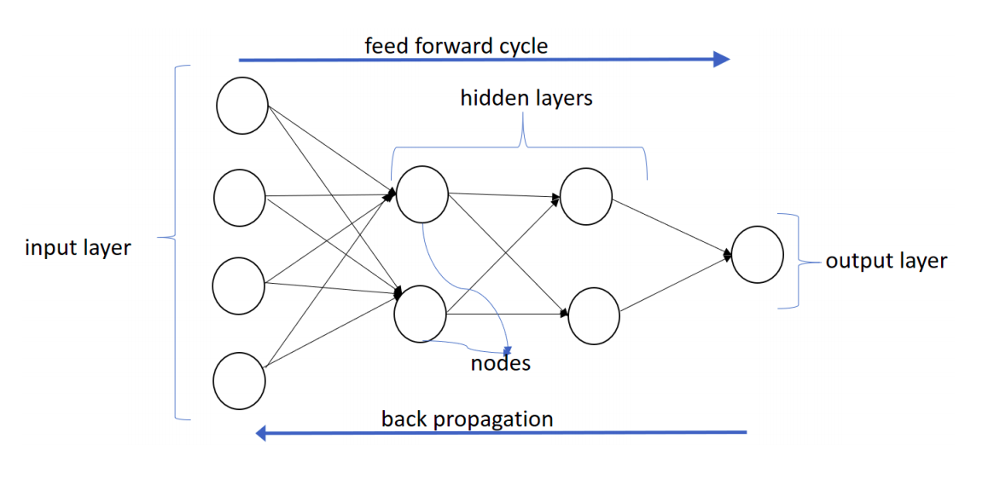

```{r setup, include=FALSE}
# clean up the environment
rm(list = ls())
# setup chunk options
knitr::opts_chunk$set(
  message = FALSE,
  warning = FALSE,
  fig.align = "center",
  comment = "#>"
)
options(scipen = 9999)

```

The following coursebook is the main part for _Online Data Science Series: Deep Learning for Sentiment Analysis_ workshop produced by the team at [**Algoritma**](http://algorit.ma/) . [**Algoritma**](http://algorit.ma/) is a data science education center based in Jakarta. We organize workshops and training programs to help working professionals and students gain mastery in various data science sub-fields: data visualization, machine learning, data modeling, statistical inference, etc.

Before you go ahead and run the codes in this coursebook, it’s often a good idea to go through some initial setup. Under the **Training Objectives** section we’ll outline the syllabus, identify the key objectives and set up expectations for each module. Under the **Libraries and Setup** section you’ll see some code to initialize our workspace and the libraries we’ll be using for the projects. You may want to make sure that the libraries are installed beforehand by referring back to the packages listed here. 

# Preface {.tabset}

## Introduction

**Text mining**, also referred to as text data mining, similar to text analytics, is the process of deriving high-quality information from text. There are many application of text mining, such as:

- Text Classification
- Text Summarization
- Text Generation
- Topic Modeling
- Named Entity Recognition

Text classification has broad applications such as *topic labeling*, *spam detection*, and **_sentiment analysis_**. Take a look at a text example below:

> *"Have bought items multiple times and very happy with services. Communications are exceptional."*

In a grand sense, we are interested in the emotional content of some text, e.g. posts on Facebook, tweets, or movie reviews. Most of the time, this is obvious when one reads it, but if you have hundreds of thousands or millions of strings to analyze, you’d like to be able to do so efficiently. Sentiment Analysis is one of a common tool to help companies, analysts and researchers to learn public opinions towards certain topics. It works by extracting positive and negative sentiments from each word of a text document. 

There are various approaches on performing sentiment analysis:

```{r sentiment, echo = FALSE, fig.align = "center", out.width="600px", fig.cap="Sentiment Analysis Techniques"}

```

In this workshop, we will later focus on one of the deep neural network technique to perform sentiment classification, Long Short-Term Memory (LSTM) networks. While most algorithms only focus on each word as single feature, the unique behaviour of LSTM is capable of learning order dependence in text sequences. 

We will later discuss more about machine learning and its approaches on sentiment analysis, but before we get there, let's first discuss about the underlying concepts of deep learning. 

## Training Objectives

The primary objective of this course is to provide a participant a comprehensive introduction about tools for building sentiment analysis model using one of the most popular open-source tools; R. The material will covers:

**Introductory Module:**

* **Tools Introduction**  
  + R and R Studio  
  + Open source packages  
  + Using R Markdown  
  + R Programming Basics  
* **Text mining in R**  
  + Preparing your text data: data cleansing and manipulation
  + Word-tokenizing to identify word’s meaning
  + Using visualization to analyze text data
  
***
**Main Module:**

* **Introduction to Neural Network and Deep Learning**  
  - Neural Network: What is it and how does it work? 
  - The exploding and vanishing gradient problem
  - Recurrent Neural Network (RNN) and the evolving LSTM

* **Sentiment Analysis with LSTM**
  - Building a neural network with LSTM using Keras
  - Model evaluation and tuning

## Library and Setup

In this **Library and Setup** section you’ll see some code to initialize our workspace, and the packages we’ll be using for this introductory session of this workshop. 

_Packages_ are collections of R functions, data, and compiled code in a well-defined format. The directory where packages are stored is called the _library_. R comes with a standard set of packages. Others are available for download and installation. Once installed, they have to be loaded into the session to be used. 

You will need to use `install.packages()` to install any packages that are not yet downloaded onto your machine. To install packages, type the command below on your console then press ENTER. 

```{r eval=FALSE}
## DO NOT RUN CHUNK
# packages <- c("tidyverse", "scales")
# 
# install.packages(packages)
```

Then you need to load the package into your workspace using the `library()` function. Special for this course, the _rmarkdown_ packages do not need to be called using `library()`.

```{r}
# # Data Wrangling
library(tidyverse) 
library(lubridate)
library(magrittr)

# Text analysis
library(textclean)
library(tidytext)
library(tm)

# Modeling
library(caret)
library(keras)
library(yardstick)

# set conda env
use_condaenv("r-tensorflow")
```

# Introduction to Deep Learning

## Machine Learning and Deep Learning Distinctions

Before we begin, let's step back a bit and put some  of the terminology we frequently hear in context, namely “*artificial intelligence*” (AI), “*machine learning*” (ML), and “*deep learning*” (DL). What’s the difference between them?

DL is a subset of ML, which is also a subset of AI. AI has broader concept that consists of everything from machine automations to all the way to futuristic technologies such as deep learning. 

ML is a subset of artificial intelligence; It is a method of training algorithms such that they can learn how to make decisions. For example[^1], here is a table that identifies the type of fruit based on its characteristics:

```{r fruits, echo = FALSE, fig.align = "center", out.width="400px"}

```

As you can see on the table above, the fruits are differentiated based on their weight and texture. However, the last row gives only the weight and texture, without the type of fruit. And, a machine learning algorithm can be developed to try to identify whether the fruit is an orange or an apple. 

The case above is an example of a **supervised learning** and algorithms like Linear Regression and KNN are used for such supervised **regression** or **classification**. Other datasets might not be labeled, and you are literally telling the algorithm such as K-Means to associate or cluster patterns that it finds without any answer sheet. This is called **unsupervised learning**.

So what about DL now? DL is a sub-branch of ML in that it also has a set of learning algorithms that can train on and learn from data, and more specifically DL is **powered by neural networks**:

```{r mldl, echo = FALSE, fig.align = "center", out.width="700px", fig.cap="Source: MerkleInc"}
knitr::include_graphics("img/ml-dl.jpg")
```

## Artificial Neural Networks

Deep learning is an exciting invention that has risen in popularity in recent years, but it's beginnings traced back to the 1950s when the earliest prototypes of **artificial neural network** algorithms were created. The algorithm is named so because it is inspired from our understanding at that time of how our biological brain responds to stimuli from sensory inputs. That is not to say that neural networks are valid representations of how our biological brain works - quite far from that! In fact, the over-sensationalization of neural network is in my opinion doing more harm to actual science than good. 

To date, there are some school of thoughts that hypothesized about how our brain works. There's the grandmother cell theory[^2], which hypothesized that "neurons represent a complex but specific concept or object". It was proposed by neuroscientists Jerry Lettvin, who suggested the notion of hyper-specific neurons that is activated by very specific prompts, such as upon hearing the mention of your grandmother, or seeing pictures of them. Advocates of this theory points to studies where participants were shown three to seven different "target" pictures of 132 photo subjects while having being observed - the researchers measured the electrical activity (activation) of the neurons connected to the electrodes and observe how neurons "almost ignored all other photos but fired steadily each time Aniston appeared on screen"[^3]. 

Other theories assert that neurons are far simpler and that the representation of complex objects are distributed across many neurons. So while the human brain is extremely complex, with around 100 billion neurons and 1,000 trillion synaptic interconnections, each neuron rely on layers of electrochemical signaling and other biological machinery to process information. 

Artificial neural networks are loosely derived from this second set of theories. A neural network architecture comprised of an arrangement of **layers** and **nodes** (representing neurons) such that "information" flows from one later and relayed to another.


Neuroscientists learn that[^4]:  

- Information from one neuron to another across a small gap called a synapse
- One sending neuron can connect to several receiving neurons  
- One receiving neuron can connect to several sending neurons  

As one receiving neuron "receives" the signal sent by the sending neuron, the biochemical process help that neuron weight the signal according to its relative importance and as it turns out, this biological mechanism serves as a great template for an artificial neuron. The neurons are represented as "nodes", and the strength between nodes are weighted to model the synapses in the biological brain. 

### A Single Neuron

The basic unit of computation in a neural network is the **neuron**, often called a **node** or **unit**. It receives input from some other nodes, or from an external source and computes an output. Each input has an associated **weight** (w), which is assigned on the basis of its relative importance to other inputs. The node applies a function **f** (defined below) to the weighted sum of its inputs as shown below:

```{r singleneuron, echo = FALSE, fig.align = "center", out.width="600px"}

```

### Neural Network Architecture

<!-- When building a neural network architecture, you can think of each neuron like a single lego brick. You can get "bigger" neural network by stacking together many of these lego bricks. Let's take a look at the following architecture: -->

<!-- ```{r ff, echo = FALSE, fig.align = "center", out.width="600px"} -->
<!--  -->
<!-- ``` -->

<!-- The neural network above has four layers; an **input layer**, two **hidden layers**, and an **output layer**.  -->

<!-- The first layer with input values (usually denoted x) is called the input layer, the middle layers with function values (usually denoted y) are called the hidden layers and the last layer with z values is called the output layer. The functions at each node are called **activation functions**, borrowing from neuroscience terminology where neurons are said to fire or activate. There may be several hidden layers and multiple nodes in each hidden layer.  -->

<!-- The easiest way to understand how a neural network works is to note that each of the inputs are provided as weighted inputs for the first hidden layer, and the outputs of the hidden layer becomes the inputs to each subsequent hidden layer. The weights vary for each node in every hidden layer and the output layer.  -->

While neural network architecture can vary in forms and design, each of them can be characterized by:

- Number of layers in the network
- Number of nodes in each layer
- Direction of signals in the network

This architectural design allow us to accommodate varying degree of complexity; a more complex network (typically means more number of layers in the network) are capable of modelling more subtle patterns within our data, and while size typically matters, the design of the architecture also plays a part in the effectiveness of a neural network. Let’s break the three concepts down:

- **Number of Layers** and **Number of Nodes**  

In the architecture above, `Var1`, `Var2` and `Var3` represent the features from our data, notice that there is one input node for each of the 3 features. When there is one hidden layer, the network is sometimes also called a "single-layer network" - they are suitable for classification tasks where the decision boundaries are fairly linear. When we have more than one hidden layer, the network qualify for the definition of a "deep neural network" (I know, I hope I was joking as well).   


- **Directions of Signals**

Neural networks can be recurrent or feed-forward. A feed-forward neural network is one where the input signal is fed continuously in one direction from layer to layer until reaching the final output layer. Despite its apparent restriction, these networks can be very well-suited and form the "foundation" of a full neural network model.  


In contrast, a recurrent neural network (feedback network) is one where signals travel in both directions using loops and unlike a feedforward network can use an internal state to process sequences of input, which gives it the ability to "exhibit dynamic temporal behavior for a time sequence", and see its use throughout vocabulary speech recognition or in time series forecasting[^6].   


## Recurrent Neural Network

In Recurrent Neural Network (RNN), neurons are fed information not just from the previous layer but also from themselves from the previous pass[^7]. RNN comes into the picture when we want to store previous information while processing the new information. This previous information is termed as a **memory**. This network works really great on the sequence of data. Data such as text and audio comes under sequence of data. For example in language processing, to predict the next words, the network should have some knowledge about the previous words. 


The above-shown figure is an unrolled recurrent neural network. In this context, unrolling simply means the number of times the part of data is being passed. For example, if we are using a sentence at its input then the length of the network will be the count of words in that sentence. That is one layer for each word. In that way, it can keep track of it:

- `x`: part of the data applied to the network. By part of the data, I mean a single word.
- `o`: is the output of each network. Suppose we are using this network for the prediction of next work then it will be all the possibility of vocabulary probability provided. Depending on the task, it will not necessary to spit out the results after each intermediate steps.
- `s`: is the memory which is being passed on to the successive network. It can be shown as `s(t) = function(W * s (t-1) + U*x(t))`.

### The Vanishing Gradient Problem of RNN

Unfortunately, the range of contextual information that standard RNNs can access is in practice quite limited. Suppose that we build a language model to predict the last word in the text:

> "I've lived in Indonesia for more than 20 years, I speak fluent Indonesian." 

Recent information (I speak fluent ...) suggests that the next word is probably the name of a language. But if we want to narrow down which language, we need the context of "Indonesia", from further back. It’s entirely possible for the gap between the relevant information and the point where it is needed to become very large. The problem with RNN is as that gap grows, RNNs become unable to learn to connect the information.

In theory, RNNs are absolutely capable of handling such “long-term dependencies.” A human could carefully pick parameters for them to solve toy problems of this form. Sadly, in practice, RNNs don’t seem to be able to learn them[^8]. This is where LSTM comes to tackle the problem.

## LSTM Network

The **Long Short Term Memory** architecture was motivated by an analysis of error flow in existing RNNs which found that long time lags were inaccessible to existing architectures, because backpropagated error either blows up or decays exponentially. An LSTM layer consists of a set of recurrently connected blocks, known as *memory blocks*. These blocks can be thought of as a differentiable version of the memory chips in a digital computer. Each one contains one or more recurrently connected memory cells and three multiplicative units – the **input**, **output** and **forget** gates – that provide continuous analogues of write, read and reset operations for the cells[^9].

The components in LSTM consist of:

- **Forget Gate** f (NN with sigmoid as activation function).
- **Candidate Layer** g (NN with tanh as activation function).
- **Input Gate** I (NN with sigmoid as activation function).
- **Output Gate** O (NN with sigmoid as activation function).
- **Hidden State** H (vector).
- **Memory State** C (vector).


- $X_t$ = Input vector at the t-time<br>
- $H_{t-_1}$ = Previous Hidden state<br>
- $C_{t-_1}$ = Previous Memory state<br>
- $H_t$ = Current Hidden state<br>
- $C_t$ = Curret Memory state<br>
- [*] = multiplication operation<br>
- [+] = addition operation<br>

Quoting from Denny Britz’s [article](http://www.wildml.com/2015/10/recurrent-neural-network-tutorial-part-4-implementing-a-grulstm-rnn-with-python-and-theano/):

1. *I, f, O* is the Input, Forget, and Output gates. Both input, forget, and output have the same function formula (sigmoid), which only distinguishes the matrix parameters (note the formula below). This means that the output of this gate has a vector of values between 0 to 1. zero means that the information is blocked completely, and one means that all information is included. The gate input controls how many states you have just computed for the current input that you want to let pass. The forget gate controls how many previous states you want to let pass. Finally, the gate output controls how many internal states you want to expose to the network (higher layer & next time step). All gates have the same dimensions as the hidden state dimension (etc.) as a measure for the hidden state. The output of the sigmoid gate will be multiplied by another value to control how much that value is used.

<center>
$I= \sigma(x_tU^I + s_{t-_1}W^I)$ <br>
$f= \sigma(x_tU^f + s_{t-_1}W^f)$ <br>
$O= \sigma(x_tU^O + s_{t-_1}W^O)$ <br>
</center

> "value 1 means “really take care of this element” while 0 means “completely get rid of this element”."

2. *g* is a “candidate” hidden state that is computed based on the current input and the previous hidden state.

3. $c_t$ is the internal memory of the unit. It is a combination of the previous memory  $c_{t-_1}$  multiplied by the forget gate, and the newly computed hidden state g, multiplied by the input gate. Thus, intuitively it is a combination of how we want to combine previous memory and the new input.

# Case Study: Airlines Sentiment Analysis with LSTM

Let's try to build our LSTM network on the airlines dataset:

```{r}
data <- read_csv("data/airlines.csv") %>% 
  select(text, label)

head(data)
```

## Text Pre-processing

### Text cleaning

```{r}
data <- data %>%
  mutate(
    text = text %>%
      replace_url()  %>% 
      replace_html() %>% 
      str_remove_all("@([0-9a-zA-Z_]+)") %>% 
      str_remove_all("#([0-9a-zA-Z_]+)") %>% 
      str_replace_all("[\\?]+", " questionmark ") %>% 
      str_replace_all("[\\!]+", " exclamationmark ") %>% 
      str_remove_all('[\\&]+') %>% 
      str_remove_all('[\\"]+') %>% 
      replace_contraction() %>%
      replace_word_elongation() %>% 
      replace_internet_slang() %>% 
      str_remove_all(pattern = "[[:digit:]]") %>% # remove number
      str_remove_all(pattern = "[[:punct:]]") %>% 
      str_remove_all(pattern = "\\$") %>% # remove dollar sign
      str_to_lower() %>% 
      str_squish(), 
    label = base::factor(label, levels = c("negative", "neutral", "positive")) %>% 
                     as.numeric() %>% {. - 1}
  ) %>% 
  select(text, label) %>% 
  na.omit() # remove NA
```

### Remove stopwords

```{r}
rm.stopwords <- VCorpus(VectorSource(data$text)) %>%
  tm_map(removeWords,stopwords("en")) %>%
  tm_map(stripWhitespace) %>% 
  sapply(as.character) %>%
  as.data.frame(stringsAsFactors = FALSE)

data.clean <- bind_cols(rm.stopwords, data[,2]) %>%
  `colnames<-`(c("text","label"))

```

### Tokenizer

After we perform all the cleaning, we will use keras `text_tokenizer()` to transform each word as separate tokens. The `num_words` parameter sets maximum number of words to consider as features.

Giving 1024 as the input means, from the total unique words that we have, we'd only use 1024 of them to make the model. 

```{r}
num_words <- 1024 

# prepare tokenizers
tokenizer <- text_tokenizer(num_words = num_words, lower = TRUE) %>% 
  fit_text_tokenizer(data.clean$text)

paste(
  "Total Unique Words:", length(tokenizer$word_counts),"|",
  "Total Features:", num_words
)

```

### Extra Explanation on Tokenizer

Suppose we have 5 pieces of text documents that are stored in the docs object. Then we made a token with a maximum of words / terms used, which is 4.

It means that words that rarely appear will not be used during the train model. To see the number of unique words stored in the document dictionary, use the command `token$word_counts`. To see the list of words with the highest frequency of appearances, use the `token$word_index` command.

```{r}
docs <- c('Well done!',
        'Good work',
        'Great effort',
        'nice work',
        'Excellent!')

tokendocs <- text_tokenizer(num_words = 4, lower = TRUE) %>% 
  fit_text_tokenizer(docs)

paste("Number of unique words:",length(tokendocs$word_counts))
```

```{r}
tokendocs$word_index[1:4]
```

## Split Data

Splitting data will be done into 3 parts, namely train, validation, and test. The proportion is 75% for trains and the remaining 25% is in partitions for data validation and testing.


Data Train is the data that we will use to train the model. Data Validation for evaluating hyperparameter tuning in models (adjust hidden layers, optimizers, learning rates, etc.). While the test data as an evaluator of the model that we make on unseen data.

```{r}
library(rsample)
set.seed(100)

# split into train - test
split <- initial_split(data.clean, strata = "label")
data_train <- training(split)
data_test <- testing(split)

# split data test to test - validation
split_val <- initial_split(data.clean, prop = 0.5, strata = "label")
data_val <- training(split_val)
data_test <- training(split_val)
```

### Text to sequence

```{r}
maxlen <- max(str_count(data.clean$text, "\\w+")) + 1 # Text cutoff
  
# prepare x
data_train_x <- texts_to_sequences(tokenizer, data_train$text) %>%
  pad_sequences(maxlen = maxlen)

data_val_x <- texts_to_sequences(tokenizer, data_val$text) %>%
  pad_sequences(maxlen = maxlen)

data_test_x <- texts_to_sequences(tokenizer, data_test$text) %>%
  pad_sequences(maxlen = maxlen)

# prepare y
data_train_y <- to_categorical(data_train$label, num_classes = 3)
data_val_y <- to_categorical(data_train$label, num_classes = 3)
data_test_y <- to_categorical(data_test$label, num_classes = 3)
```

Command `texts_to_sequence()` aims to create a matrix results of the transformation text to the form of a number sequence (integer). Then wrapped with the command `pad_sequences()` which aims to equalize the dimensions of the length on the entire document.

Imagine the input layer of a matrix, it must have the same row and column. Therefore it is necessary to do padding. By default the value parameter will be set to 0. This means that if there are words that are not in our token (which has been limited by num_words) then it will be transformed to 0. The following is the illustration:

```{r}
texts_to_sequences(tokendocs, c("Excellent!", 
                                "Good job bro, keep hard work", 
                                "well done")) %>% 
  pad_sequences(maxlen = 5)

```

## Build Architecture

### 1. Model Initialization

### Embedding Layer

Embedding Layers can only be used in the initial / first layer of the LSTM architecture. In a variety of deep learning frameworks such as Keras, the embedding layer aims to train text data into numerical vectors which represent the closeness of the meaning of each word.

Embedding layer accepts several parameters. Some examples are:

- `input_dim`: the maximum dimension of the vocabulary that has been explained in the ``num_words` section.
- `input_length`: the maximum length of the word sequence in the document input.
- `output_dim`: the embedding dimension of the output layer which will be passed to the next layer. generally is 32, but can be more dependent on the problem we face.

### Deep Neural Layer

The Deep Network Layer accepts the embedding matrix as input and then is converted into smaller dimensions. The dimensions of the compression results have represented information from the data. In the case of data text, the deep learning architecture commonly used is RNN > LSTM / GRU.

You can check the [Keras Documentation](https://keras.io/preprocessing/sequence/) for the details sequential layers.

### Output Layer

This output layer is the last layer in the deep learning architecture. At Keras use the layer_dense command where we need to set the unit parameters or how many neurons we want to build. In this case I use 3 units, because there are 3 classes we have (negative, neutral, positive).


```{r}
# initiate keras model sequence
model <- keras_model_sequential()

# model
model %>%
  # layer input
  layer_embedding(
    name = "input",
    input_dim = num_words,
    input_length = maxlen, 
    output_dim = 32
  ) %>%
  # layer dropout
  layer_dropout(
    name = "embedding_dropout",
    rate = 0.5
  ) %>%
  # layer lstm 1
  layer_lstm(
    name = "lstm",
    units = maxlen,
    dropout = 0.25,
    recurrent_dropout = 0.25,
    return_sequences = FALSE, 
  ) %>%
  # layer output
  layer_dense(
    name = "output",
    units = 3,
    activation = "softmax"
  )
```

- Dropout parameters are added to reduce the risk of overfit. the range of dropout values between 0 to 1. commonly used is 0.2 to 0.5. the closer to 0 will tend to overfit, while the closer to 1 has the risk of underfit.


### 2. Model Compiling

For two category classes, the lost function used is `binary_crossentropy` while for multiclass cases it uses `categorical_crossentropy`. There are not only 2 option, but the most common when working with classification cases, these 2 loss functions are used. Here are some loss function options from [Keras Documentation](https://keras.io/losses/).

```{r}
# compile the model
model %>% compile(
  optimizer = "adam",
  metrics = "accuracy",
  loss = "categorical_crossentropy"
)

# model summary
summary(model)
```

## Model Training

```{r}
# model fit settings
epochs <- 10
batch_size <- 128

# fit the model
history <- model %>% fit(
  data_train_x, data_train_y,
  batch_size = batch_size, 
  epochs = epochs,
  verbose = 1,
  validation_data = list(
    data_test_x, data_test_y
  )
)

# history plot
plot(history)
```


## Model Evaluation

```{r}
# predict on test
data_test_pred <- model %>%
  predict_classes(data_test_x) %>%
  as.vector()

# performance on "unseen data"
accuracy_vec(
 truth = factor(data_test$label,labels = c("negative", "neutral", "positive")),
 estimate = factor(data_test_pred, labels = c("negative", "neutral", "positive"))
)

```

# Reference

[^1]: [Towards Data Science](https://towardsdatascience.com/clearing-the-confusion-ai-vs-machine-learning-vs-deep-learning-differences-fce69b21d5eb)
[^2]: [Wikipedia, Grandmother Cell](https://en.wikipedia.org/wiki/Grandmother_cell)
[^3]: Quiroga R.Q, Reddy L., Kreiman, G., Koch C., Fried I., Invariant visual representation by single neurons in the human brain, Nature. 2005
[^4]: [Learn.Genetics, Genetic Science Learning Center, UTAH](http://learn.genetics.utah.edu/content/neuroscience/neurons/)
[^5]: [Wikipedia article on Feed Forward Neural Network](https://en.wikipedia.org/wiki/Feedforward_neural_network)
[^6]: [Gunther, F., Fritch S., Training of Neural Networks](https://journal.r-project.org/archive/2010/RJ-2010-006/RJ-2010-006.pdf)
[^7]: [Neural Network Zoo](https://www.asimovinstitute.org/neural-network-zoo/)
[^8]: [Christopher Olah, Understanding LSTM](https://colah.github.io/posts/2015-08-Understanding-LSTMs/)
[^9]: [Alex Graves, et al., Framewise Phoneme Classification with Bidirectional LSTM and Other Neural Network Architectures, 2005.](http://ieeexplore.ieee.org/document/1556215/?reload=true&arnumber=1556215)
