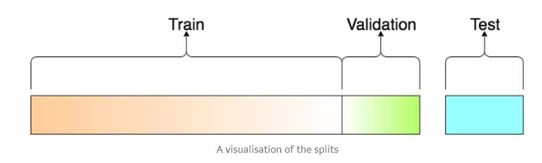

```{r setup, include=FALSE}
knitr::opts_chunk$set(echo = TRUE)
```

# Introduction to Neural Network

## Build Architecture with R's `neuralnet`

```{r message=FALSE, warning=FALSE}
library(tidyverse)
library(neuralnet)

library(tm)
library(textclean)
```

Membuat model dengan neuralnet:

```{r}
# Generate data dummy sebagai contoh

y <- c(0,1,1,0)
dat <-  data.frame(expand.grid(c(0,1), c(0,1), c(1,2)), y)

set.seed(100)
dat <- dat %>% 
  mutate(y = runif(nrow(dat), 3, 4) + sum(dat[1:2,]) + dat$Var3^2)

head(dat)
```


```{r}
set.seed(100) # random seed

model1 <- neuralnet(
    formula = y~. , #prediksi y berdasarkan semua prediktor
    data = dat, #data yang digunakan adalah data "dat"
    hidden = 4 , # membuat 4 nodes pada 1 hidden layer
    linear.output = TRUE, # utk kasus regresi isi True
    #startweights = 1, # inisiasi awal
    rep = 5 # membuat 5 model sekaligus
    )

plot(model1, rep = "best") #best mengembalikan model dengan error terkecil
```


Proses training model 
1. Neural network memberikan **Pembobotan awal secara random** untuk setiap node
2. Aliran informasi terjadi untuk melakukan prediksi dari input -> hidden -> output layer 
3. Dari hasil 1 feed forward akan didapatkan **error (cost function)** dari hasil prediksi
4. Model "belajar dari kesalahan" dengan menyalurkan kembali informasi error ke node-node sebelumnya (**back propragration**) sehingga bobot dapat diperbaiki (**diupdate**)
- satu kali rangkaian proses update (1 kali feed forward + 1 back prop) disebut **epoch** atau **steps**
5. model akan terus update bibit hingga didapatkan error terkecil. 
Pada contoh diatas 283 step/epoch untuk mendapatkan error terkecil


**Glossary Arsitektur Neural Network**

- *weight*: informasi yang dibawa oleh setiap neuron, sama seperti "slope" pada persamaan garis/regresi. Awalnya bobot ini akan di inisialisasi secara random.
- *bias*: sama seperti "konstanta" pada persamaan garis. Awalnya bias akan di inisialisasi secara random
- *Activation function* : fungsi untuk standarisasi hasil perhitungan
- *Forward propagation*: proses membawa data input melewati tiap neuron pada hidden layer sampai pada output layer yang nantinya akan dihitung errornya
- *Backpropogation*: proses membawa error yang didapat dari forward propagation untuk mengupdate setiap weight dan bias. 
- *Cost function*: Error. Selisih antara hasil prediksi dan data aktual. cross entropy (`ce`) untuk klasifikasi dan sum square of error (`sse`) untuk regresi.
- *Epoch*: Banyaknya proses iterasi (1x forward dan 1x backward = 1 epoch) dalam training model.


## Deep learning 

 **Deep learning** ternyata hanyalah suatu neural network yang memiliki jumlah hidden layer yang lebih dari satu:

```{r}
set.seed(100)

model1 <- neuralnet(
    formula = y~. , #prediksi y berdasarkan semua prediktor
    data = dat, #data yang digunakan adalah data "dat"
    hidden = c(3,4), # membuat 4 nodes pada 1 hidden layer
    linear.output = TRUE, # utk kasus regresi isi True
    #startweights = 1, # inisiasi awal
    rep = 5 # membuat 5 model sekaligus
    )

plot(model1, rep = "best") #best mengembalikan model dengan error terkecil
```

# RNN and LSTM

# Building LSTM Model for Sentiment Analysis

Cek instalasi keras:

```{r}
# library(dplyr)
# library(keras)
# 
# use_condaenv("r-tensorflow")
# 
# model <- keras_model_sequential() %>% 
# layer_dense(units = 3, input_shape = 4)
# 
# model
```

```{r}
library(keras)
use_condaenv("r-tensorflow")
```

## Read data

````{r}
data <- read_csv("data/airlines.csv") %>% 
  select(text, label)

head(data)
```

## Text Pre-processing

```{r}
data <- data %>%
  mutate(
    text = text %>%
      replace_url()  %>% 
      replace_html() %>% 
      str_remove_all("@([0-9a-zA-Z_]+)") %>% 
      str_remove_all("#([0-9a-zA-Z_]+)") %>% 
      str_replace_all("[\\?]+", " questionmark ") %>% 
      str_replace_all("[\\!]+", " exclamationmark ") %>% 
      str_remove_all('[\\&]+') %>% 
      str_remove_all('[\\"]+') %>% 
      replace_contraction() %>%
      replace_word_elongation() %>% 
      replace_internet_slang() %>% 
      str_remove_all(pattern = "[[:digit:]]") %>% # remove number
      str_remove_all(pattern = "[[:punct:]]") %>% 
      str_remove_all(pattern = "\\$") %>% # remove dollar sign
      str_to_lower() %>% 
      str_squish(), 
    label = base::factor(label, levels = c("negative", "neutral", "positive")) %>% 
                     as.numeric() %>% {. - 1}
  ) %>% 
  select(text, label) %>% 
  na.omit() # remove NA
```

Keterangan tambahan pada proses cleaning:
1. `str_replace_all("[\\?]+", " questionmark ")` = replace tanda baca "?" dengan "questionmark". karena RNN memperhatikan data t-1 dan t+1 maka tanda baca tdk diremove, tapi direplace dengan nama tanda baca.<br>
2. `column = factor(label, levels) %>% as.numeric() %>%  {.-1}`
  - Mengubah kategori dalam representasi angka:
    - "negative" = 0
    - "neutral" = 1
    - "positive" = 2

Remove stopwords:

```{r}
rm.stopwords <- VCorpus(VectorSource(data$text)) %>%
  tm_map(removeWords,stopwords("en")) %>%
  tm_map(stripWhitespace) %>% 
  sapply(as.character) %>%
  as.data.frame(stringsAsFactors = FALSE)

data.clean <- bind_cols(rm.stopwords, data[,2]) %>%
  `colnames<-`(c("text","label"))

```

## Tokenizer

Tahap ini untuk memisahkan tiap kata di seluruh dokumen menjadi bentuk token. Parameter `num_words` untuk mengatur jumlah maksimum kata yang akan digunakan, di sort berdasarkan urutan frekuensi yang terbesar. kata yang jarang muncul akan dihilangkan. dari total 11079 kata unique yg terdapat di data teks, kita reduksi menjadi 1024 saja yang akan digunakan untuk membuat model. 

Parameter `lower` adalah sebuah logika kondisi, jika TRUE maka seluruh kata akan di transformasi ke huruf kecil (tolower). 

```{r}
num_words <- 1024 

# prepare tokenizers
tokenizer <- text_tokenizer(num_words = num_words, lower = TRUE) %>% 
  fit_text_tokenizer(data.clean$text)

paste(
  "Total Unique Words:", length(tokenizer$word_counts),"|",
  "Total Features:", num_words
)
```

### Extra explanation on "Tokenizer", "Text to seq" & "pad sequence"

```{r}

data_example <- data.frame(
  text = c('Budi is doing such a great job',
        'Good job',
        'Great work',
        'Keep up the good work')  
)

token_example <- text_tokenizer(num_words = 4, lower = TRUE) %>% 
  fit_text_tokenizer(data_example$text)

```

Misal saya punya 5 buah dokumen teks yang di simpan ke dalam objek `data_example`. Kemudian saya membuat token dengan maksimum words/term (kata) yang digunakan yaitu 4. Artinya kata yang jarang muncul tidak akan digunakan pada saat train model. Untuk melihat jumlah kata unique yang tersimpan di dictionary dokumen, gunakan command `token$word_counts`. Untuk melihat list kata dengan frekuensi kemunculan tertinggi, gunakan command `token$index_word`. 

```{r}
#token$word_counts
paste("jumlah kata unique di dictionary:",length(token_example$word_counts))

token_example$index_word[1:4] # 4 kata yang akan digunakan.
```
```{r}
# data_example %>% 
#   tidytext::unnest_tokens(word, text) %>% 
#   count(word, sort = T) %>% 
#   head(4)

texts_to_sequences(token_example, 'Budi is doing such a great job') %>% 
  pad_sequences(7)
```

## Split data

Disini akan dilakukan splitting data menjadi 3 bagian yaitu train, validation, dan test. Proporsinya sebesar 60% untuk train dan sisanya 40% di partisi untuk data validation dan testing. 



- **Train**: data yang akan kita gunakan untuk melatih model (menyesuaikan weight dan bias)
- **Validation**: data untuk evaluasi tuning hyperparameter di model (mengataur hidden layer, optimizer, learning rate dll)
- **Test**: "unseen data". simulasi performance model untuk future data

```{r}
library(rsample)
set.seed(100)

# split into train - test
split <- initial_split(data.clean, strata = "label")
data_train <- training(split)
data_test <- testing(split)

# split data test to test - validation
split_val <- initial_split(data.clean, prop = 0.6, strata = "label")
data_val <- training(split_val)
data_test <- training(split_val)
```

### Split x & y

```{r}
maxlen <- max(str_count(data.clean$text, "\\w+")) + 1 # Text cutoff
  
# prepare x
data_train_x <- texts_to_sequences(tokenizer, data_train$text) %>%
  pad_sequences(maxlen = maxlen)

data_val_x <- texts_to_sequences(tokenizer, data_val$text) %>%
  pad_sequences(maxlen = maxlen)

data_test_x <- texts_to_sequences(tokenizer, data_test$text) %>%
  pad_sequences(maxlen = maxlen)

# prepare y
data_train_y <- to_categorical(data_train$label, num_classes = 3)
data_val_y <- to_categorical(data_val$label, num_classes = 3)
data_test_y <- to_categorical(data_test$label, num_classes = 3)
```

## Build Architecture

### Embedding Layer: 

Embedding Layer hanya dapat digunakan di layer awal/pertama pada arsitektur Deep Learning. Pada berbagai macam framework deep learning seperti Keras, embedding layer berfungsi untuk training data teks menjadi vektor numerik yang merupakan representatif kedekatan makna tiap kata. Proses ini disebut word embedding. Lihat kesini untuk pembahasan [word embedding](https://rpubs.com/ahmadhusain/wordembedding). Proses word embedding ada dua opsi, dapat dilakukan pada saat training model. Atau dapat pula dilakukan pre-trained untuk menghasilkan model word embedding (word2vec/glove model), kemudian model tersebut kita jadikan input di embedding layer. Pada inclass ini, kita menggunakan opsi yang pertama.

Embedding layer menerima beberapa parameter, diantaranya:

- `input_dim`: ukuran maksimum dimensi dari kata-kata (vocabulary), dijelaskan dgn `num_words`
- `input_length`: batas maksimum panjang dari sekuen kata pada input dokumen, dijelaskan dgn `maxlen`
- `output_dim`: dimensi embedding dari output layer yang akan diterukan ke layer selanjutnya. umunya adalah 32, namun dapat lebih tergantung dengan masalah yang dihadapi. 

input yang diterima berupa vektor 2D dengan bentuk: {batch_size, sequence_length}, sedangkan output yang diterima adalah tensor 3D dengan bentuk {batch_size, sequence_length, output_dim}.

### Deep Network Layer:

Deep Network Layer menerima matriks embedding sebagai input dan kemudian dikonversi menjadi dimensi yang lebih kecil. Hasil kompresi dimensi tersebut telah mewakili informasi dari data. Pada kasus data teks, arsitektur deep learning yang biasa digunakan yaitu RNN > LSTM/GRU. 

Parameter `dropout` ditambahkan untuk mengurangi risiko overfit: range nilai `dropout` antara 0 hingga 1, yang umum digunakan yaitu 0.2 hingga 0.5. makin mendekati 0 akan cenderung overfit, sedangkan makin mendekati 1 memiliki risiko underfit.  

> Lebih detailnya terkait masing-masing layer sekuensial silahkan kunjungi website [keras documentation](https://keras.io/preprocessing/sequence/).

### Output Layer

Output layer ini adalah layer terakhir pada arsitektur deep learning. Di keras menggunakan command `layer_dense` dimana kita perlu mengatur parameter `units` atau berapa banyak neuron yang ingin kita bangun. Di kasus ini kita menggunakan 3 unit, karena kelas yang kita miliki ada 3 (`negative`, `neutral`, `positive`).

### Activation Function

Transformasi nilai untuk menyesuaikan output untuk setiap kasusnya. ada beberapa pilihan activation function, antara lain: <br>

1. `sigmoid` : hasil transformasi nilainya diantara 0-1 cocok digunakan untuk binary class.<br>
2. `softmax` : hasil transformasi menjadi nilai probabilitas antara 0-1 cocok dgunakan untuk multiclass.<br>
3. `tanh`    : hasil transformasi nilainya diantara -1 hingga 1.

dan masih banyak lagi pilihannya [keras documentation](https://keras.io/activations/). <br>


```{r}
# initiate keras model sequence
model <- keras_model_sequential()

# model
model %>%
  # layer input
  layer_embedding(
    name = "input",
    input_dim = num_words,
    input_length = maxlen, 
    output_dim = 32
  ) %>%
  # layer lstm 1
  layer_lstm(
    name = "lstm",
    units = 30,
    dropout = 0.25,
    recurrent_dropout = 0.25,
    return_sequences = FALSE, 
  ) %>%
  # layer output
  layer_dense(
    name = "output",
    units = 3,
    activation = "softmax"
  )
```

### Lost function and Optimizer 

Model membutuhkan loss function dan optimizer parameter pada saat dilatih (training model). Untuk kasus klasifikasi, loss function yang umum digunakan:
- `binary_crossentropy`: kategori dgn 2 kelas
- `categorical_crossentropy`: kategori multiclass

Pilihannya tidak hanya 2 saja, ada beberapa pilihan, namun yang umum ketika bekerja dengan kasus klasifikasi, 2 fungsi tersebut yang digunakan. Berikut adalah beberapa pilihan loss function dari [keras documentation](https://keras.io/losses/).

Disini algoritma optimasi yang digunakan pada saat training adalah `adam` [paper : Adam: A method for stochastic optimization](https://arxiv.org/abs/1412.6980v8). adam menerima beberapa parameter, salah satunya adalah learning rate: yaitu tingkat pembelajaran yang kita atur pada saat training untuk update weight hingga mencapai local minimum (error terkecil). intervalnya antara 0 hingga 1 dimana semakin mendekati 0 akan membutuhkan waktu lama mencapai local minimum, tapi jika mendekati 1 akan berakibat terjebak di titik yang bukan menjadi local minimumnya.

```{r}
# compile the model
model %>% compile(
  optimizer = "adam",
  metrics = "accuracy",
  loss = "categorical_crossentropy"
)

# model summary
summary(model)
```

## Model Fitting

- `epoch` : adalah banyak iterasi pada saat training model (update weight). umumnya, akurasi model akan meningkat dengan jumlah epoch yang lebih banyak. namun menyesuaikan dengan kasus masing-masing. bisa di evaluasi lewat grafik history train modelnya, jika kurva akurasi masih cenderung naik, maka ada kemunkinan jika ditambahkan jumlah epochnya akan meningkatkan nilai akurasi.<br>
- `batch_size` : penentuan jumlah sampel yang di training pada tiap epoch. umumnya, makin besar batch size proese training akan lebih cepat, tapi tidak selalu konvergen dengan cepat. kebalikannya, makin kecil batch size akan mengakibatkan training lama, namun proses konvergennya lebih cepat.

```{r}
# model fit settings
epochs <- 10
batch_size <- 128

# fit the model
history <- model %>% fit(
  data_train_x, data_train_y,
  batch_size = batch_size, 
  epochs = epochs,
  verbose = 1,
  validation_data = list(
    data_test_x, data_test_y
  )
)

# history plot
plot(history)
```

### Model Tuning

Anda dapat mengembangkan model LSTM untuk meningkatkan performa hasil prediksinya. beberapa cara yang dapat dilakukan antara lain:

1. Fine tune hyperparameters : yaitu mengubah beberapa variabel yang ditetapkan sebelum training. misal, learning rate, batch size, jumlah epoch. Tuning parameternya dapat dilakukan dengan cara manual trial and error, menggunakan parameter flags berikt [1](https://tensorflow.rstudio.com/tools/tfruns/articles/tuning.html) [2](https://github.com/rstudio/keras/issues/100)<br>
2. meningkatkan kualitas dataset pada saat pra-proses. memperbaiki kualitas data teks dapat dilakukan dengan menghapus beberapa simbol karakter yang tidak diperlukan, angka, stopwords dan lainnya. Proses stemming juga dapat dilakukan tapi saya tidak terlalu merekomendasikan.<br>
3. menggunakan layer dropout. teknik untuk menghindari terjadi overfitting dan berpeluang untuk meningkatkan akuraasi pada data validasi.<br>

## Model Evaluation

### Predict on 'unseen" data

```{r}
# predict on test
data_test_pred <- model %>%
  predict_classes(data_test_x) %>%
  as.vector()
```

### Evaluate performance

```{r}
# performance on test
accuracy_vec(
 truth = factor(data_test$label,labels = c("negative", "neutral", "positive")),
 estimate = factor(data_test_pred, labels = c("negative", "neutral", "positive"))
)

```
