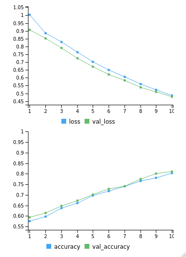

# Case Study: Finance News dataset Sentiment Analysis

## Library Needed
```{r}
# # Data Wrangling
library(tidyverse) 
library(lubridate)
library(magrittr)

# Text analysis
library(textclean)
library(tidytext)
library(tm)

# Modeling
library(caret)
library(keras)
library(yardstick)

# set conda env
use_condaenv("r-tensorflow")
```


```{r}
data <- read_csv("data/finance_news.csv", col_names = F) %>% 
  rename(
    label = X1,
    text = X2
  )

head(data)
```

## Text Pre-processing
### Text Cleaning

- clean the text data by removing some unnecessary symbols, urls, etc
- formatting text
- change label 'negative' = 0, 'neutral' = 1, 'positive' = 2


```{r}
data <- data %>%
  mutate(
    text = text %>%
      replace_url()  %>% 
      replace_html() %>% 
      str_remove_all("@([0-9a-zA-Z_]+)") %>% 
      str_remove_all("#([0-9a-zA-Z_]+)") %>% 
      str_replace_all("[\\?]+", " questionmark ") %>% 
      str_replace_all("[\\!]+", " exclamationmark ") %>% 
      str_remove_all('[\\&]+') %>% 
      str_remove_all('[\\"]+') %>% 
      replace_contraction() %>%
      replace_word_elongation() %>% 
      replace_internet_slang() %>% 
      str_remove_all(pattern = "[[:digit:]]") %>% # remove number
      str_remove_all(pattern = "[[:punct:]]") %>% 
      str_remove_all(pattern = "\\$") %>% # remove dollar sign
      str_to_lower() %>% 
      str_squish(), 
    label = base::factor(label, levels = c("negative", "neutral", "positive")) %>% 
                     as.numeric() %>% {. - 1}
  ) %>% 
  select(text, label) %>% 
  na.omit() # remove NA
```

### Remove stopwords

- Removed stopwords based on 'English' corpus data

```{r}
rm.stopwords <- VCorpus(VectorSource(data$text)) %>%
  tm_map(removeWords,stopwords("en")) %>%
  tm_map(stripWhitespace) %>% 
  sapply(as.character) %>%
  as.data.frame(stringsAsFactors = FALSE)

data.clean <- bind_cols(rm.stopwords, data[,2]) %>%
  `colnames<-`(c("text","label"))
```

```{r}
head(data.clean)
```
## Tokenizer

- using Keras `text_tokenizer()` to transform each cleaned word as separate tokens
```{r}
num_words <- 1024

# prepare tokenizers
tokenizer <- text_tokenizer(num_words = num_words, lower = TRUE) %>% 
  fit_text_tokenizer(data.clean$text)

paste(
  "Total Unique Words:", length(tokenizer$word_counts),"|",
  "Total Features:", num_words
)
```

## Split Data
```{r}
library(rsample)
set.seed(100)

# split into train - test
split <- initial_split(data.clean, strata = "label")
data_train <- training(split)
data_test <- testing(split)

# split data test to test - validation
split_val <- initial_split(data.clean, prop = 0.5, strata = "label")
data_val <- training(split_val)
data_test <- training(split_val)
```


## Text to sequence
```{r}
maxlen <- max(str_count(data.clean$text, "\\w+")) + 1 # Text cutoff
  
# prepare x
data_train_x <- texts_to_sequences(tokenizer, data_train$text) %>%
  pad_sequences(maxlen = maxlen)

data_val_x <- texts_to_sequences(tokenizer, data_val$text) %>%
  pad_sequences(maxlen = maxlen)

data_test_x <- texts_to_sequences(tokenizer, data_test$text) %>%
  pad_sequences(maxlen = maxlen)

# prepare y
data_train_y <- to_categorical(data_train$label, num_classes = 3)
data_val_y <- to_categorical(data_train$label, num_classes = 3)
data_test_y <- to_categorical(data_test$label, num_classes = 3)
```

## Build Architecture
```{r}
# initiate keras model sequence
model <- keras_model_sequential()

# model
model %>%
  # layer input
  layer_embedding(
    name = "input",
    input_dim = num_words,
    input_length = maxlen, 
    output_dim = 32
  ) %>%
  # layer dropout
  layer_dropout(
    name = "embedding_dropout",
    rate = 0.5
  ) %>%
  # layer lstm 1
  layer_lstm(
    name = "lstm",
    units = maxlen,
    dropout = 0.25,
    recurrent_dropout = 0.25,
    return_sequences = FALSE, 
  ) %>%
  # layer output
  layer_dense(
    name = "output",
    units = 3,
    activation = "softmax"
  )
```

## Model Compiling
```{r}
# compile the model
model %>% compile(
  optimizer = "adam",
  metrics = "accuracy",
  loss = "categorical_crossentropy"
)

# model summary
summary(model)
```
## Model Training
```{r}
# model fit settings
epochs <- 10
batch_size <- 128

# fit the model
history <- model %>% fit(
  data_train_x, data_train_y,
  batch_size = batch_size, 
  epochs = epochs,
  verbose = 1,
  validation_data = list(
    data_test_x, data_test_y
  )
)

# history plot
# plot(history)
```


## Model Evaluation
```{r}
# predict on test
data_test_pred <- model %>%
  predict_classes(data_test_x) %>%
  as.vector()

# performance on "unseen data"
accuracy_vec(
 truth = factor(data_test$label,labels = c("negative", "neutral", "positive")),
 estimate = factor(data_test_pred, labels = c("negative", "neutral", "positive"))
)
```

# Create a Wordcloud based on clean data
## Data pre-processing
```{r}
finance_news <- read_csv("data/finance_news.csv", col_names = F) %>% 
  rename(
    label = X1,
    text = X2
  )

head(finance_news)
```
```{r}
finance_news_clean <- finance_news %>%
  mutate(
    text_clean = text %>%
      replace_url()  %>% 
      replace_html() %>% 
      str_remove_all("@([0-9a-zA-Z_]+)") %>% # remove username
      str_remove_all("#([0-9a-zA-Z_]+)") %>% # remove hashtag
      replace_contraction() %>%
      replace_word_elongation() %>% 
      replace_internet_slang() %>% 
      str_remove_all(pattern = "[[:digit:]]") %>% # remove number
      str_remove_all(pattern = "%") %>% 
      str_remove_all(pattern = "\\$") %>% # remove dollar sign
      str_to_lower() %>% # transform to lower case
      str_squish()  # remove extra whitespace
  ) %>% 
  select(text, text_clean, label)

head(finance_news_clean)
```

## Tokenize
```{r}
finance_news_clean <- finance_news_clean %>% 
  select(-text) %>% 
  unnest_tokens(word, text_clean) 

head(finance_news_clean)
```

## Remove Stopwords
```{r}
finance_news_clean <- finance_news_clean %>% 
  anti_join(stop_words)
```
## Text Visualization
```{r}
finance_news_clean %>% 
  count(word, label, sort = T) %>% 

  group_by(label) %>%
  top_n(20) %>%
  
  ggplot(aes(label = word, size = n, color = n)) +
  ggwordcloud::geom_text_wordcloud() +
  facet_wrap(~label) +
  scale_size_area(max_size = 15) 
```


